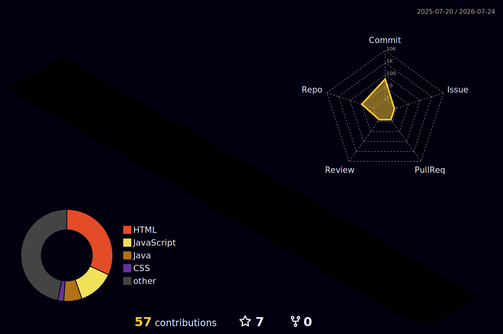

<!-- Animated header -->

<!-- Typing animation -->

<!-- Profile views + followers -->

---

## About me

I am a **Software Engineer** and **Java Developer** with a Master of Computer Applications (MCA).  
Passionate about building robust backend systems, full-stack applications, and insightful data dashboards.

---

## Tech stack & tools

**Languages:**

**Frameworks:**

**Databases:**

**Cloud & tools:**

**Productivity & AI:**

 
  <!-- Working Google Tools -->
  &nbsp;  &nbsp;
  &nbsp;
    <!-- Forums & AI -->
  &nbsp;
  &nbsp; <!-- Fixed ChatGPT -->
  &nbsp;
  

---
<!--
### Omnitrix tech stack animation

  
  
  

--->

## GitHub stats

---

## Contribution snake

---

## 3D contribution graph

---

## Recent projects

| Project | Description |
|---|---|
| AI Disease Risk Prediction | AI system for early disease risk identification |
| Interactive Data Dashboards | Dynamic reporting dashboards using SQL/CSV + Power BI |
| Custom Quiz Application | Full-stack quiz platform deployed via Git |
| Financial Risk Exposure Study | Academic research analyzing financial risk & stability |

---

## Currently exploring

- Google Cloud Skills Boost pathways
- Expanding GCP resource knowledge

---

## Let's connect

---

<!-- Animated footer -->

